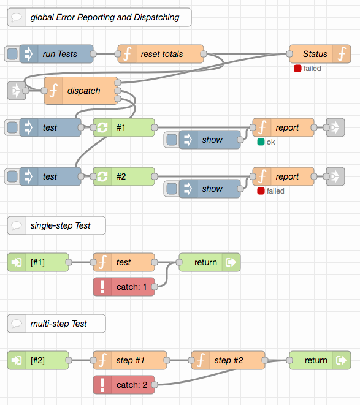

# node-red-test-support #

Every piece of software should be tested - preferrably automatically. This repository contains some nodes and flows to support automated tests with Node-RED.

> Nota bene: the "system-under-test" does not necessarily have to be a Node-RED flow, it may well be an external system which is just to be tested by means of Node-RED

## Prerequisites ##

Every example requires the following Node-RED extension

* [node-red-contrib-components](https://github.com/ollixx/node-red-contrib-components) "Components" allow multiply needed flows to be defined once and then invoked from multiple places

## License ##

[MIT License](LICENSE.md)
